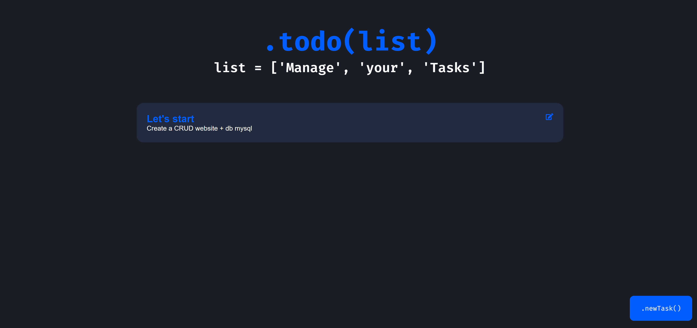

# todo-list

### Database setup

- Install MySQL and run the server on the port 3306 (on Ubuntu `sudo apt-get install mysql-server` and `sudo mysql_secure_installation utility` to setupt the password for root)
- access to the db using `sudo mysql -u root -p`
- Create an user with 
  ```
  CREATE USER 'todo'@'localhost' IDENTIFIED BY 'P@s$w0rd123!';
  GRANT ALL PRIVILEGES ON * . * TO 'todo'@'localhost';
  FLUSH PRIVILEGES;
  \q
  ```
- Login with the new user `mysql -u todo -p`
- Create the database `CREATE DATABASE todo;`

### Run Flask
- In the folder path install the dependecies with `pip install -r requirements.txt'
- Run flask with `python main.py`

### View the website

- Connect to the http://127.0.0.1:5500/


