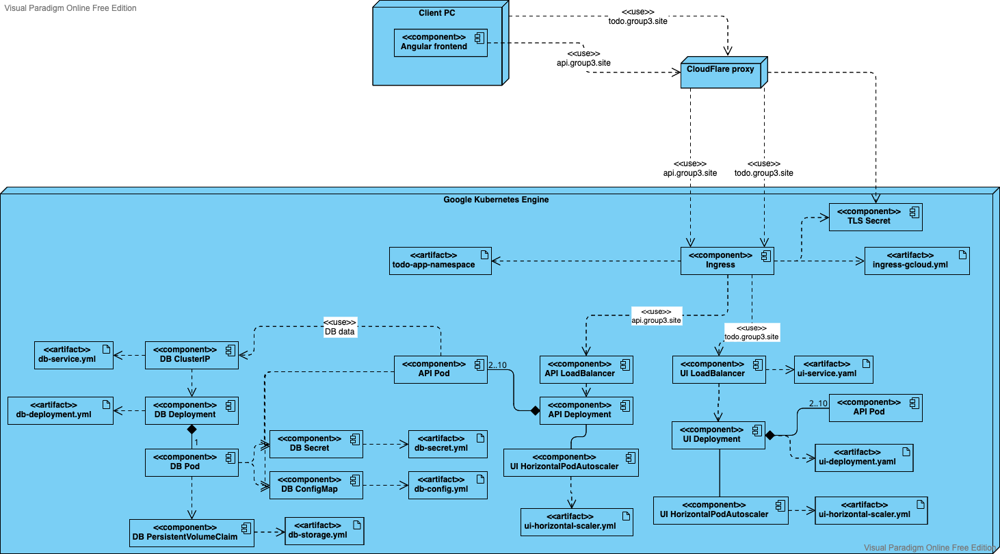

# :whale: ToDo App :memo:

This repository (accessible at [ThreeLittleBirdsContainerized/todo-app](https://github.com/ThreeLittleBirdsContainerized/todo-app)) contains a project realized as part of the *Software Containerization* course of the Master's degree in Artificial Intelligence, Vrije Universiteit Amsterdam. 

*ToDo App* is a website allowing simple Create, Read, Update, Delete operations to manage tasks. It is composed of:  

- frontend built in Angular, reading data from the API  
- API built in Python with Flask   
- MySQL database, implemented on MariaDB

This project coded from scratch and google cloud was used to deploy the project.

These components are deployed in containers using Kubernetes Engine on Google Cloud.

A demo of the application is available at the following link: [https://todo.group3.site](https://todo.group3.site/)

## Repository structure

    .
    ├── presentation.pdf                    # Slides showed during the presentation
    ├── uml.png                             # UML diagram of the project
    ├── todo-app                            # Folder containing the project code
    │   ├── .github                     
    |   │   └── workflows                   # Workflow for Github action
    │   ├── helm                     
    |   │   └── todo-app-chart              # Helm chart of the project
    │   ├── todo-ui            
    │   │   ├── angular                     # Folder of the angular project containing the Dockerfile to build the image
    │   │   ├── ui-deployment-gcloud.yaml   # Deployment for the ui pods
    │   │   ├── ui-horizontal-scaler.yaml   # Horizonatal pod autoscaler for the ui pods
    │   │   └── ui-service.yaml             # Loadbalancer for the ui pods 
    │   ├── todo-api          
    │   │   ├── api-deployment-gcloud.yaml  # Deployment for the api pods
    │   │   ├── api-horizontal-scaler.yaml  # Horizonatal pod autoscaler for the api pods
    │   │   ├── api-service.yaml            # Loadbalancer for the api pods 
    │   │   ├── app.py                      # Source code for the API using Flask
    │   │   ├── database.py                 # Class defining functions to access to the database data
    │   │   └── Dockerfile                  # Dockerfile to build the api image
    │   ├── todo-db          
    │   │   ├── db-deployment.yaml          # Deployment for the db pod
    │   │   ├── db-storage-gcloud.yaml      # PersistentVolumeClaim for the volume definition
    │   │   ├── db-service.yaml             # ClusterIP for the db pod 
    │   │   ├── db-config.yaml              # Config file for access to the database
    │   │   └── db-secret.yaml              # Password for the database users
    │   ├── network-policy                  # Ingress and egress rules for db, api and ui
    │   ├── rbac                            # Folder containing yaml files to connect user (gmail account since we are using the google cloud) to roles
    │   ├── ingress-gcloud.yaml             # Ingress to expose the api and ui services externally
    │   ├── todo-app-namespace.yaml         # Namespace within which to create all the K8s objects 
    └── README.md

## Schema

The architecture of the project is represented in the following UML diagram:

## Versioning

We use Git for versioning.

## Group members
*Group 3 - Software Containerization 2022 - VU*

| Student No. |   Name   | Surname |           Email           |                Username                 |
| :---------: | :------: | :-----: | :-----------------------: | :-------------------------------------: |
|   2738163         |  Behnam  | Borzogi | `b.bozorgi@student.vu.nl` |      [behnam7171](https://github.com/behnam7171)      |
|   2740494   | Giuseppe |  Murro  |  `g.murro@student.vu.nl`  |  [_gmurro_](https://github.com/gmurro)  |
|   2741135   |  Simone  | Montali | `s.montali@student.vu.nl` | [_montali_](https://github.com/montali) |
  
